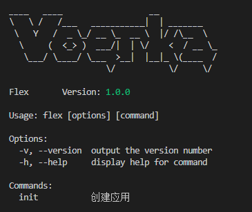
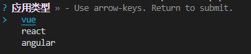

# 快速入门

`MixedCli`是一个命令行应用开发框架，其主要是对`commander`和`prompts`的封装，提供了更加友好的命令行开发体验。

以下我们将通过一个典型的`monorepo`工程，来介绍如何使用`MixedCli`开发命令行应用。

拟开发一个名为`flex`多包应用，该应用提供了`@flex/cli`，需要达成以下效果：

- `@flex/cli`提供了名称为`flex`的命令
- `flex init`用来初始化`vue`、`react`、`angular`应用
- `flex dev`用来启动开发应用
- 开发者要使用`flex`时，只需要安装`@flex/cli`，然后:
    如果要开发`vue`应用，则安装`@flex/vue`，则可以使用`flex init`创建`vue`应用开发
    如果要开发`react`应用，则安装`@flex/react`，则可以使用`flex init`创建`react`应用开发
    如果要开发`angular`应用，则安装`@flex/angular`，则可以使用`flex init`创建`angular`应用开发
- 如果开发者没有安装`@flex/cli`、`@flex/react`、`@flex/angular`中的任意一个，则执行`flex dev`时会用户选择其中的一个，或者在命令行通过`-t`来传入。
- 考虑到创建`vue`、`react`、`angular`应用的相关逻辑的不一样，我们不希望将所有逻辑代码均放在`@flex/cli`中，而分别位于`packages/vue`,`packages/react`,`packages/angular`中。这样最大的优点在于，由于应用逻辑并不存在于`@flex/cli`，`@flex/cli`仅是一个入口，所以`@flex/cli`可以保持稳定。

## 第1步：创建工程

首先创建一个`monorepo`工程，工程结构如下：

```shell
flex
  |-- packages
    |-- cli     // [!code ++]
    |-- vue
    |-- react
    |-- angular
  |-- package.json
```

示例工程名为`flex`，工程中的包名分别是`@flex/cli`、`@flex/angular`、`@flex/vue`、`@flex/react`。

## 第2步：创建命令行应用

`@flex/cli`是命令行应用，对外提供名称为`flex`的命令。

### 1. 安装依赖

::: code-group

```bash [npm]
npm install mixed-cli
```

```bash [pnpm]
pnpm add mixed-cli
```

```bash [yarn]
yarn add mixed-cli
```
:::

### 2. 创建`cli.js`

在`@flex/cli`包中创建`cli.js`文件，内容如下：

```
flex
  |-- pacakges
    |-- cli
      |-- cli.js
      |-- init.js
      |-- package.json

```

主要内容如下：

::: code-group

```ts [cli.js]
const { MixedCli } = require("mixed-cli") 

const cli = new MixedCli({
    name: "flex",
    version: "1.0.0",
    include: /^\@flex\//,  //  [!code ++]
    logo: String.raw`
        ____   ____                  __            
        \   \ /   /___   ___________|  | _______   
         \   Y   /  _ \_/ __ \_  __ \  |/ /\__  \  
          \     (  <_> )  ___/|  | \/    <  / __ \_
           \___/ \____/ \___  >__|  |__|_ \(____  /
                            \/           \/     \/`, 
})
cli.run()

```

```json [package.json]
{
  "name": "@flex/cli",
  "version": "1.0.0",
  "bin": {
    "flex": "cli.js"
  }
}
```

:::

`@flex/cli`仅仅是一个命令行的入口：

- **重点：**`include: /^\@flex\// `的意思是告诉`mixed-cli`,当执行`flex`命令时，会在当前工程中搜索以`@flex/`开头的包，然后包中声明在`cli`文件夹下的所有命令被合并到`flex`命令中。
- 上面所说的`当前工程`指的是安装了`@flex/cli`的工程，而不是我们的示例工程。
- `@flex/cli`中使用`cli.register(initCommand)`，注册一个通用的`init`命令，该命令的实现在`init.js`中。 一般可以在此工程提供一些通用命令,而其他的命令声明逻辑在分别在`@flex/*/cli/*.js`等包中实现。


## 第3步: 创建init命令

接下来,我们在`@flex/cli`中创建一个`init`命令。

```bash 
flex
 |-- pacakges
    |-- cli
       |-- cli.js
       |-- init.js   // [!code ++]
       |-- package.json 
```

编写`packages/cli/init.js`文件，内容如下：

 
```js 

const { MixedCommand } = require('mixed-cli');

/**
 * @param {import('mixed-cli').MixedCli} cli
 */
module.exports = (cli)=>{                
    const initCommand = new MixedCommand("init");
    initCommand
        .description("创建应用")         
        .option("-t, --type <type>", "应用类型",{choices:["vue","react","angular"]})
        .action((options)=>{            
            console.log("Run init:",options.type)
        })
    return initCommand
} 
    
   
``` 

然后，我们在`packages/cli/index.js`中注册`init`命令。

```js
const { MixedCli } = require("mixed-cli") 
const initCommand = require("./init")  // [!code ++]
const cli = new MixedCli({
    name: "flex",
    include: /^\@flex\//,  //  [!code ++] 
    //...
})
cli.register(initCommand)
cli.run()

```

现在执行`flex`命令，可以看到`init`命令已经被注册到`flex`命令行中了。



如果运行`flex init`，则会执行`init`命令就会自动提示用户选择,然后执行`action`函数。




## 第4步：命令选项分布式处理

在本例中，我们为`init`命令设计了`["vue","react","angular"]`三个选项。

常规情况下，我们会按照如下方式处理命令选项：

```js{9-15}
// packages/cli/init.js
const { MixedCommand } = require('mixed-cli');
module.exports = (cli)=>{                
    const initCommand = new MixedCommand("init");
    initCommand
        .description("创建应用")         
        .option("-t, --type <type>", "应用类型",{choices:["vue","react","angular"]})
        .action((options)=>{            
            if(optins.type === "vue"){
                // ...
            }else if(optins.type === "react"){
                // ...
            }else if(optins.type === "angular"){
                // ...
            }
        })
    return initCommand
} 
```

这种处理方式下，我们需要在`@flex/cli`中包含所有的`vue/react/angular`处理逻辑的代码，这样会导致`@flex/cli`包变得臃肿并且不易维护。

更好的处理方式是，将`vue/react/angular`的处理逻辑分别放在`@flex/vue/cli/init.js`、`@flex/react/cli/init.js`、`@flex/angular/cli/init.js`中，然后在`@flex/cli/init.js`中根据用户的选择，调用对应的处理逻辑。

**`MixedCli`提供了这样的分布式处理命令选择的能力。**

我们分别在`@flex/vue/cli/init.js`、`@flex/react/cli/init.js`、`@flex/angular/cli/init.js`中实现`init`命令的处理逻辑。

::: code-group

```js [packages/vue/cli/init.js]
const { MixedCommand,BREAK } = require('mixed-cli');
module.exports = (cli)=>{                
    cli.find("init").then(initCommand=>{
      initCommand
          .action((options)=>{      
              if(options.type === "vue"){     
                console.log("Run init :",options.type)
                return BREAK
              }
          })
    });        
}     
```

```js [packages/react/cli/init.js]
const { MixedCommand,BREAK } = require('mixed-cli');
module.exports = (cli)=>{                
    cli.find("init").then(initCommand=>{
      initCommand
          .action((options)=>{      
              if(options.type === "react"){     
                console.log("Run init :",options.type)
                return BREAK
              }
          })
    });        
}     
```

```js [packages/angular/cli/init.js]
const { MixedCommand,BREAK } = require('mixed-cli');
module.exports = (cli)=>{                
    cli.find("init").then(initCommand=>{
      initCommand
          .action((options)=>{      
              if(options.type === "angular"){     
                console.log("Run init :",options.type)
                return BREAK
              }
          })
    });        
}     
```

:::


- 在`src/cli`目录下创建`init.js`文件，用于声明`init`命令。`cli`目录下的所有`js`文件会被自动加载,每个文件均导出一个函数，该函数需要返回一个或多个`MixedCommand`实例。`cli`目录是一个默认的约定目录，可以通过`cli.cliDir`参数修改。
- 创建`MixedCommand`实例，用于声明命令。`MixedCommand`继承自`commander`的`Command`类，因此可以使用`commander`的所有特性。
- `package.json`只需要将`mixed-cli`添加为依赖即可。
- 同样地，我们可以在`@flex/react`,`@flex/app`等包中创建其他的命令。

## 第4步: 使用命令

 我们在`flex`应用中开发。

- **安装`@flex/cli`包**

::: code-group

```shell [npm]
npm install @flex/cli @flex/vue
```

```shell [pnpm]
pnpm add @flex/cli @flex/vue
```

```shell [yarn]
yarn add @flex/cli @flex/vue
```
:::

安装`@flex/cli`包后，就可以在命令行中使用`flex`和`flex init`命令了。

此时执行一下`flex`命令，会看到如下输出：

```shell{15}
____   ____                  __
\   \ /   /___   ___________|  | _______
 \   Y   /  _ \_/ __ \_  __ \  |/ /\__  \
  \     (  <_> )  ___/|  | \/    <  / __ \_
   \___/ \____/ \___  >__|  |__|_ \(____  /
                    \/           \/     \/
版本号:1.0.0 
Usage: flex [options] [command]

Options:
  -v, --version      当前版本号
  -h, --help         显示帮助

Commands:
  init [options]    初始化应用  // 只有这个命令 
```


- **接下来我们安装`@flex/vue`**

::: code-group

```shell [npm]
npm install @flex/vue @flex/vue
```

```shell [pnpm]
pnpm add @flex/vue @flex/vue
```

```shell [yarn]
yarn add @flex/vue @flex/vue
```
:::
 
此时再执行一下`flex`命令，会看到如下输出：

```bash
____   ____                  __
\   \ /   /___   ___________|  | _______
 \   Y   /  _ \_/ __ \_  __ \  |/ /\__  \
  \     (  <_> )  ___/|  | \/    <  / __ \_
   \___/ \____/ \___  >__|  |__|_ \(____  /
                    \/           \/     \/
版本号:1.0.0 
Usage: flex [options] [command]

Options:
  -v, --version      当前版本号
  -h, --help         显示帮助

Commands:
  init [options]    初始化应用  
  # dev命令是由@flex/vue包提供的
  dev [options]     以开发模式启动应用  //   [!code ++]
```


## 第5步: 自动推断交互提示

在上面`dev`命令中，共指定了`6`个选项，当执行`flex dev`命令时, 会根据配置自动交互引导用户输入选项，如下：


- 命令行的交互体验与使用`commander`时完全一样
- 仅当选项未指定默认值或满足一定条件时，才会根据一定的规则自动推断交互提示类型。详见[自动推断交互提示](./guide/infer-prompt.md)
- `MixedCli`使用`prompts`来实现交互提示，因此支持`prompts`的所有交互类型特性。详见[prompts](https://github.com/terkelg/prompts)


## 小结

- `MixedCli`是一个基于`commander`的命令行工具开发框架，提供了一套命令行开发的最佳实践。
- `MixedCli`能对所有命令行选项自动推断交互提示类型，当用户没有输入选项时，会自动引导用户输入选项，提供友好的用户体验。
- `MixedCli`可以在当前工程自动搜索满足条件的包下声明的命令进行合并，从而实现扩展命令的目的。此特性可以保持@flex/cli包的精简和稳定，给用户一致的体验。


```js [vue/src/cli/init.js]

const { MixedCommand } = require('mixed-cli');

/**
 * @param {import('mixed-cli').MixedCli} cli
 */
module.exports = (cli)=>{                

    const devCommand = new MixedCommand();
    devCommand
        .name('dev')
        .description("以开发模式启动应用")      // 未指定默认值,自动使用text类型提供                       
        .option("-p,--port <port>","指定端口号",3000)                      
        .option("-d,--debug" ,"调试模式",{ default:true,prompt:true })      
        .option("-h,--host <host>","指定主机名",{default:"localhost",prompt:true})                         
        .option("-e,--env [value]","环境变量",{ prompt:false })                                   
        .option("-m,--mode <mode>","指定模式",{choices:["development","production","test","debug"]})
        .option("-f,--framework [value]","开发框架",{choices:[
            {title:"vue",value:1},
            {title:"react",value:2,description:"默认"},
            {title:"angular",value:3}
        ]})
        .option("-o,--open","自动打开浏览器",{prompt:{          // 自定义提示
            type:"toggle",
            message:"是否自动打开浏览器？",
        }})
        .action((options)=>{            
            console.log("run dev")
        })

    return devCommand
} 
    
   
```